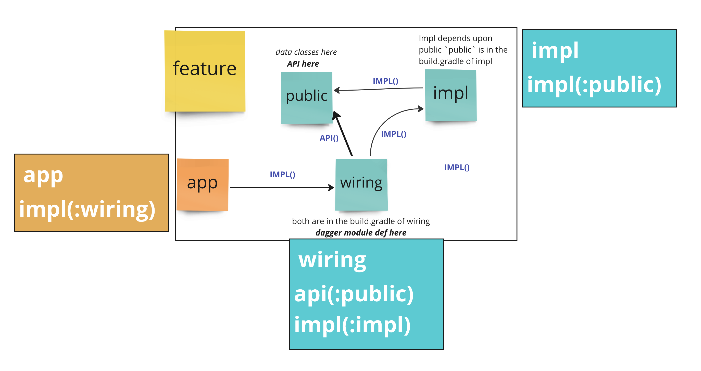

## Example repo for education use

A simple example repo to implement the idea of 3 modules for a feature.
* public - exposes interfaces and APIs and data classes
* implementation - implements the interface
* wiring - DI wiring to connect the two and has api(public) and impl(impl)

See useful image:

